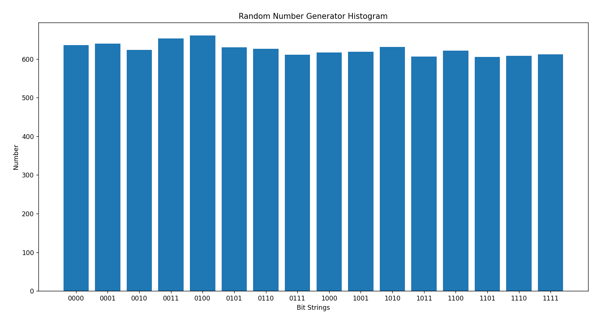

# Quantum-Scholars-Hackathon

Problem Set 1 Question 3 Screenshot

Problem Set 2 Question 3
(i) Let n be small (say less than 10). Running the protocol 10 times, is Eve detected in every case?

    No, Eve is not detected in every case. Since n is small, there is higher chance that Eve could guess the state of the bits that Alice sent.
    
(ii) Let n be large (say more than 1000). Running the protocol 10 times, is Eve detected in every case?

    Yes, Eve is detected in every case. Since n is large, the probability that Eve guesses the correct state of the bits that Alice sent is so small that she is basically guaranteed to get detected in every trial.
    
(iii) Based on your observations in cases when Eve is not detected what would you guess is the expected length of SK in terms of n?

    I would guess that the expected length of SK is about n/2 because t is generated randomly so that half of the bits should be 1 and half of the bits should be 0.
